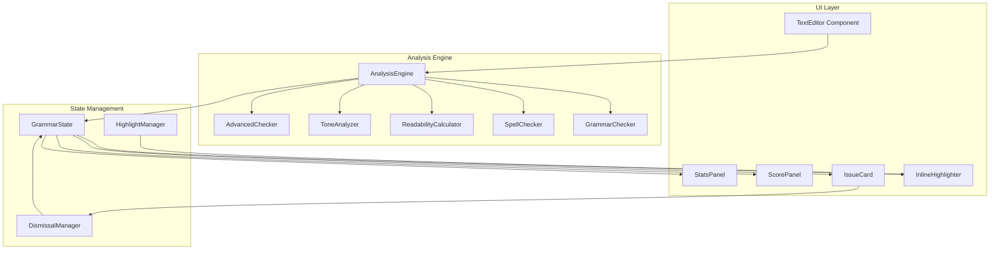

# Design Document: Enhanced Grammar Checker

## Overview

The Enhanced Grammar Checker transforms the existing basic grammar checking tool into a comprehensive Grammarly-like writing assistant. The system provides real-time inline error highlighting, one-click corrections, writing quality scoring, readability analysis, and tone detection. Built as a React component using TypeScript, it leverages the existing `compromise` NLP library while adding custom analysis engines for advanced writing feedback.

## Architecture



## Components and Interfaces

### Core Interfaces

```typescript
interface GrammarIssue {
  id: string;
  type: 'correctness' | 'clarity' | 'engagement' | 'delivery';
  severity: 'error' | 'warning' | 'suggestion';
  message: string;
  description: string;
  startIndex: number;
  endIndex: number;
  originalText: string;
  suggestions: Correction[];
  rule: string;
}

interface Correction {
  text: string;
  confidence: number;
  description?: string;
}

interface AnalysisResult {
  issues: GrammarIssue[];
  score: WritingScore;
  readability: ReadabilityMetrics;
  tone: ToneAnalysis;
  statistics: TextStatistics;
}

interface WritingScore {
  overall: number; // 0-100
  correctness: number;
  clarity: number;
  engagement: number;
  delivery: number;
}

interface ReadabilityMetrics {
  fleschKincaidGrade: number;
  educationLevel: string;
  averageSentenceLength: number;
  averageWordLength: number;
  difficultSentences: number[];
}

interface ToneAnalysis {
  dominant: ToneType;
  breakdown: ToneBreakdown[];
  isConsistent: boolean;
  inconsistencies: ToneInconsistency[];
}

type ToneType = 'formal' | 'informal' | 'confident' | 'neutral' | 'friendly';

interface ToneBreakdown {
  tone: ToneType;
  percentage: number;
}

interface ToneInconsistency {
  startIndex: number;
  endIndex: number;
  detectedTone: ToneType;
  expectedTone: ToneType;
}

interface TextStatistics {
  wordCount: number;
  characterCount: number;
  characterCountNoSpaces: number;
  sentenceCount: number;
  paragraphCount: number;
  averageSentenceLength: number;
  readingTimeMinutes: number;
}

interface DismissedPattern {
  rule: string;
  originalText: string;
  timestamp: number;
}
```

### Component Interfaces

```typescript
interface EnhancedGrammarCheckerProps {
  onBack: () => void;
  initialText?: string;
}

interface InlineHighlighterProps {
  text: string;
  issues: GrammarIssue[];
  onIssueHover: (issue: GrammarIssue | null) => void;
  onIssueClick: (issue: GrammarIssue) => void;
  dismissedPatterns: Set<string>;
}

interface IssueCardProps {
  issue: GrammarIssue;
  onApplyCorrection: (correction: Correction) => void;
  onDismiss: () => void;
  position: { x: number; y: number };
}

interface ScorePanelProps {
  score: WritingScore;
  previousScore?: number;
  isAnimating: boolean;
}

interface StatsPanelProps {
  statistics: TextStatistics;
  readability: ReadabilityMetrics;
  tone: ToneAnalysis;
}

interface CategoryFilterProps {
  categories: IssueCategory[];
  activeCategory: string | null;
  onCategorySelect: (category: string | null) => void;
}

interface IssueCategory {
  id: string;
  name: string;
  count: number;
  isResolved: boolean;
}
```

## Data Models

### Issue Category Colors

```typescript
const CATEGORY_COLORS = {
  correctness: { underline: '#e53e3e', bg: '#fed7d7' },  // Red
  clarity: { underline: '#3182ce', bg: '#bee3f8' },      // Blue
  engagement: { underline: '#38a169', bg: '#c6f6d5' },   // Green
  delivery: { underline: '#805ad5', bg: '#e9d8fd' },     // Purple
};
```

### Readability Grade Mapping

```typescript
const GRADE_LEVELS: Record<number, string> = {
  1: 'Grade 1',
  2: 'Grade 2',
  3: 'Grade 3',
  4: 'Grade 4',
  5: 'Grade 5',
  6: 'Grade 6',
  7: 'Grade 7',
  8: 'Grade 8',
  9: 'High School Freshman',
  10: 'High School Sophomore',
  11: 'High School Junior',
  12: 'High School Senior',
  13: 'College Freshman',
  14: 'College Sophomore',
  15: 'College Junior',
  16: 'College Senior',
  17: 'Graduate Level',
};
```

### Analysis Rules Configuration

```typescript
interface AnalysisRule {
  id: string;
  category: GrammarIssue['type'];
  severity: GrammarIssue['severity'];
  pattern: RegExp | ((text: string, nlp: any) => Match[]);
  message: string;
  getSuggestions: (match: string, context: string) => Correction[];
}

interface Match {
  text: string;
  startIndex: number;
  endIndex: number;
}
```

## Correctness Properties

*A property is a characteristic or behavior that should hold true across all valid executions of a system-essentially, a formal statement about what the system should do. Properties serve as the bridge between human-readable specifications and machine-verifiable correctness guarantees.*

### Property 1: Inline highlight position accuracy
*For any* text containing a known grammar or spelling error, the Grammar_Checker SHALL produce an issue with startIndex and endIndex that exactly match the position of the erroneous text segment.
**Validates: Requirements 1.1**

### Property 2: Multiple error detection per sentence
*For any* sentence containing N distinct grammar/spelling errors (where N > 1), the Grammar_Checker SHALL detect and return N separate issues, each with a distinct position range and appropriate category color.
**Validates: Requirements 1.3**

### Property 3: Correction application transforms text correctly
*For any* text with an issue at position [start, end] and a correction suggestion, applying the correction SHALL result in text where the substring at [start, start + correction.length] equals the correction text.
**Validates: Requirements 2.2**

### Property 4: Re-analysis after correction
*For any* text where a correction is applied, the Grammar_Checker SHALL re-analyze the modified text and return a new AnalysisResult reflecting the current state.
**Validates: Requirements 2.3**

### Property 5: Writing score bounds
*For any* text input (including empty string), the Grammar_Checker SHALL calculate a WritingScore where overall, correctness, clarity, engagement, and delivery are all integers in the range [0, 100].
**Validates: Requirements 3.1**

### Property 6: Score improvement on fix
*For any* text with at least one issue, fixing that issue SHALL result in a WritingScore.overall that is greater than or equal to the previous score.
**Validates: Requirements 3.3**

### Property 7: Issue categorization completeness
*For any* set of detected issues, every issue SHALL have a type in {'correctness', 'clarity', 'engagement', 'delivery'}, and the sum of issues per category SHALL equal the total issue count.
**Validates: Requirements 4.1, 4.2**

### Property 8: Readability score calculation (Flesch-Kincaid)
*For any* text with at least one sentence, the ReadabilityMetrics.fleschKincaidGrade SHALL equal: 0.39 × (totalWords / totalSentences) + 11.8 × (totalSyllables / totalWords) - 15.59, rounded to one decimal place.
**Validates: Requirements 5.1**

### Property 9: Education level mapping
*For any* Flesch-Kincaid grade level G, the educationLevel string SHALL correspond to the appropriate grade in the GRADE_LEVELS mapping (clamped to range [1, 17]).
**Validates: Requirements 5.2**

### Property 10: Readability issue detection
*For any* sentence with more than 25 words, the Grammar_Checker SHALL include that sentence's index in ReadabilityMetrics.difficultSentences. *For any* text where average word length exceeds 6 characters, the Grammar_Checker SHALL generate at least one clarity issue suggesting simpler alternatives.
**Validates: Requirements 5.3, 5.4**

### Property 11: Tone analysis validity
*For any* text with at least one sentence, the ToneAnalysis SHALL have a dominant tone in {'formal', 'informal', 'confident', 'neutral', 'friendly'}, and the sum of all ToneBreakdown percentages SHALL equal 100.
**Validates: Requirements 6.1, 6.2**

### Property 12: Mixed tone detection
*For any* text containing sentences with detectably different tones, the ToneAnalysis.isConsistent SHALL be false, and ToneAnalysis.inconsistencies SHALL contain at least one entry identifying the conflicting segments.
**Validates: Requirements 6.4**

### Property 13: Advanced writing issue detection
*For any* text containing: (a) passive voice constructions, (b) known wordy phrases, (c) known clichés, or (d) inconsistent number formatting, the Grammar_Checker SHALL detect and flag each with an appropriate issue and suggestion.
**Validates: Requirements 7.1, 7.2, 7.3, 7.4**

### Property 14: Dismissal state management
*For any* dismissed issue pattern P: (a) the issue SHALL be excluded from WritingScore calculation, (b) if pattern P appears again in the same session, it SHALL NOT be re-flagged, (c) after clearing all text, pattern P SHALL be flagged if it reappears.
**Validates: Requirements 8.2, 8.3, 8.4**

### Property 15: Statistics calculation accuracy
*For any* text T, the TextStatistics SHALL satisfy:
- wordCount = count of whitespace-separated tokens
- characterCount = T.length
- characterCountNoSpaces = T.replace(/\s/g, '').length
- sentenceCount = count of sentence-ending punctuation
- readingTimeMinutes = Math.ceil(wordCount / 200)
- averageSentenceLength = wordCount / sentenceCount
**Validates: Requirements 9.1, 9.2, 9.3, 9.4**

## Error Handling

### Analysis Errors
- If NLP parsing fails, fall back to regex-only analysis
- If text is empty, return empty issues array with zero scores
- If text exceeds 50,000 characters, analyze in chunks and merge results

### UI Errors
- If issue position is invalid (out of bounds), skip rendering that highlight
- If correction application fails, show error toast and preserve original text
- If score calculation produces NaN, default to 0

### State Errors
- If dismissal storage exceeds 1000 patterns, remove oldest entries
- If highlight positions overlap, prioritize higher severity issues

## Testing Strategy

### Dual Testing Approach

The testing strategy employs both unit tests and property-based tests:

- **Unit tests** verify specific examples, edge cases, and error conditions
- **Property-based tests** verify universal properties that should hold across all inputs
- Together they provide comprehensive coverage

### Property-Based Testing Framework

The project will use **fast-check** for property-based testing in TypeScript/JavaScript. Each property test will:
- Run a minimum of 100 iterations
- Be tagged with a comment referencing the correctness property: `**Feature: enhanced-grammar-checker, Property {number}: {property_text}**`
- Generate random but valid inputs using smart generators

### Test Categories

1. **Analysis Engine Tests**
   - Property tests for issue detection accuracy
   - Property tests for score calculation bounds
   - Property tests for readability formula correctness
   - Unit tests for specific grammar rules

2. **Correction Application Tests**
   - Property tests for text transformation correctness
   - Property tests for re-analysis triggering
   - Unit tests for edge cases (empty text, overlapping corrections)

3. **State Management Tests**
   - Property tests for dismissal behavior
   - Property tests for score updates
   - Unit tests for state reset on clear

4. **Statistics Tests**
   - Property tests for calculation accuracy
   - Unit tests for edge cases (empty text, single word)

5. **Tone Analysis Tests**
   - Property tests for percentage sum invariant
   - Property tests for consistency detection
   - Unit tests for known tone patterns
